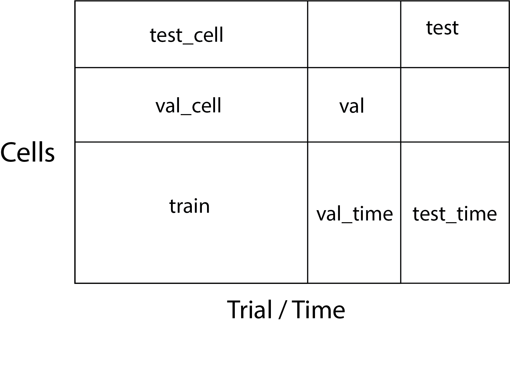

To select splits:

# Hyperparameter tuning
CUDA_VISIBLE_DEVICES=2,3,4,5,6,7 python3 v1_hptune.py

# Training
CUDA_VISIBLE_DEVICES=2 python3 v1_train.py

# Open tensorboard
tensorboard --logdir=runs/ --bind_all --port=6010
